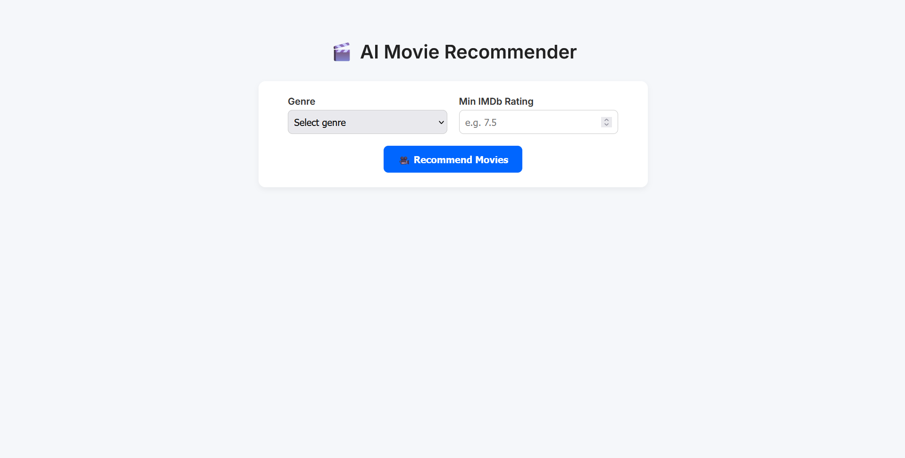
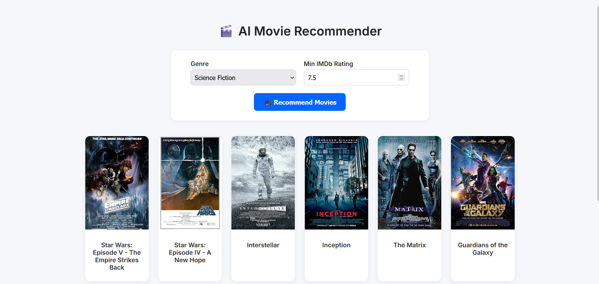

# 🎬 AI Movie Recommender

A full-stack movie recommendation web app powered by machine learning. Users select a genre and IMDb rating to get top movie suggestions with posters, using a trained `RandomForestRegressor` and the OMDb API.

<br>

---

## 🚀 Features

- 🔍 AI-powered IMDb rating predictions
- 🎭 Filter by genre and rating
- 🖼️ Movie posters via OMDb API
- 🌐 Flask-based backend + responsive HTML/CSS frontend


---

## ⚙️ Setup

```bash
pip install flask pandas scikit-learn requests
```
Run the following from the `Source Code` Folder

<br>

Run Movie Recommend API:
```
python model.py
```

Run frontend server:

```
python app.py
```

Visit: http://127.0.0.1:8080

⚠️ Replace [REDACTED] in frontend_server.py with your OMDb API key

<br>

---
## 📸 Screenshot

<br>






